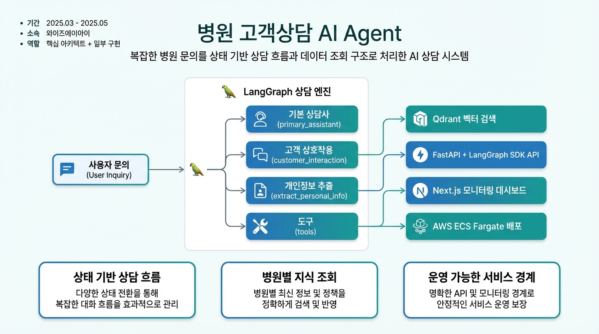
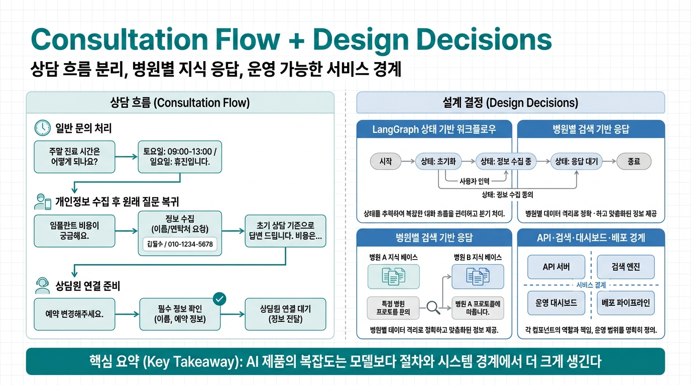

# 병원 고객상담 AI Agent

> 복잡한 병원 문의를 단순 FAQ가 아니라 실제 상담 흐름으로 다루기 위해, LangGraph 기반 상담 아키텍처와 검색·API·운영 경계를 함께 설계한 프로젝트

---

## 프로젝트 개요

| 항목 | 내용 |
|------|------|
| **기간** | 2025.03 - 2025.05 |
| **소속** | 와이즈에이아이 |
| **역할** | 핵심 아키텍트 + 일부 구현 |

이 프로젝트는 의료기관 고객 상담을 자동화하기 위한 AI Agent 시스템이다. 단순히 질문에 답하는 챗봇을 만드는 것이 아니라, 병원 문의가 실제 상담처럼 이어지도록 대화 상태를 관리하고, 필요한 경우 개인정보 수집과 상담원 연결 준비까지 하나의 흐름으로 연결하는 것이 목표였다.

초기부터 내가 맡은 일은 "어떻게 답할지"보다 "상담이 어떤 구조로 흘러가야 하는지"를 정하는 것이었다. LangGraph 기반 상담 플로우와 상태 모델을 중심에 두고, 병원별 지식 조회, API 서버, 검색 시스템, 운영 대시보드, 배포 경계까지 한 서비스로 묶는 아키텍처를 주도했다.

### 시스템 아키텍처

---

## 문제 정의

병원 고객 문의는 겉보기보다 복잡하다. 운영시간, 위치, 진료과, 의료진, 시술 안내처럼 지식 조회로 답할 수 있는 질문도 많지만, 상담 흐름은 그보다 더 복합적이다.

- 같은 대화 안에서 정보 안내와 개인정보 수집이 섞여 나온다.
- 상담원 연결이 필요한 경우에도 사용자의 질문 맥락을 잃지 않아야 한다.
- 병원마다 안내해야 할 정보가 달라서, 고정 답변만으로는 운영하기 어렵다.

핵심 과제는 "답변을 잘하는 모델"이 아니라, **복잡한 병원 문의를 안정적으로 처리하는 상담 구조**를 만드는 일이었다. 그래서 이 프로젝트는 FAQ 응답기보다 상담 시스템으로 접근했고, 설계의 출발점도 프롬프트보다 흐름 제어와 상태 모델에 두었다.

---

## 핵심 설계 의사결정

### 1. LangGraph 기반으로 상담 흐름과 상태를 분리했다

상담은 한 번의 답변으로 끝나지 않는다. 일반 문의를 처리하다가 개인정보 수집으로 전환될 수 있고, 수집이 끝나면 다시 원래 질문으로 돌아가야 한다. 이 흐름을 프롬프트만으로 제어하면 분기가 늘어날수록 유지보수가 어려워진다.

그래서 `primary_assistant`, `customer_interaction`, `extract_personal_info`, `tools`처럼 역할이 다른 노드를 분리하고, `pending_question`, `collected_info`, `is_personal_info_saved`, `current_node` 같은 상태를 명시적으로 관리했다. 답변 생성과 상담 단계 제어를 분리해두니 분기 추가와 후속 수정이 훨씬 다루기 쉬워졌다.

### 2. 병원별 지식 데이터를 검색 기반 응답으로 연결했다

병원 상담은 병원마다 답이 다르다. 운영시간, 방문 안내, 의료진 정보, 진료·시술 안내, 증명서 관련 정보, 이벤트 정보처럼 응답 근거가 병원별 데이터에 달려 있기 때문이다.

응답을 고정 문구로 만들지 않고, 병원 웹사이트 데이터를 수집·구조화한 뒤 검색 시스템을 통해 조회하도록 설계했다. 그 결과 상담 에이전트는 공통 대화 로직 위에서 병원별 데이터에 근거한 답변을 만들 수 있었고, 운영 병원이 늘어나도 구조를 유지할 수 있었다.

### 3. 에이전트만이 아니라 서비스 전체 경계를 함께 설계했다

상담 품질은 모델이나 프롬프트만으로 결정되지 않는다. 실제 운영을 위해서는 API 서버, 검색 시스템, 운영 대시보드, 배포 구조가 함께 맞물려야 한다.

이 때문에 FastAPI + LangGraph SDK 기반 비동기 API 서버, Qdrant 기반 검색 시스템, Next.js 기반 모니터링 대시보드, AWS ECS Fargate 기반 배포 구조를 한 묶음의 서비스 경계로 정의했다. 상담 로직을 운영 가능한 제품 형태로 옮기려면 이 레이어들이 처음부터 같이 설계되어야 했다.

---

## 시스템 동작 방식

### 일반 문의 처리

사용자가 운영시간이나 위치, 진료 관련 정보를 물으면 `primary_assistant`가 먼저 질문 의도를 해석한다. 병원 지식 조회가 필요하면 검색 도구를 호출하고, 검색된 결과를 근거로 응답을 구성한다. 이 구조 덕분에 같은 질문이라도 병원별 데이터에 맞는 답을 반환할 수 있었다.

예를 들어 사용자가 "주말에도 피부과 진료하나요?"라고 물으면, 에이전트는 먼저 일반 문의로 분류한 뒤 병원별 운영시간과 진료과 관련 데이터를 조회하고, 그 결과를 조합해 답한다. 제품 관점에서는 "질문 분류 → 검색 호출 → 근거 응답 생성"이 분리되어 있어야 검색 품질이나 API 응답을 각각 개선할 수 있었다.

### 개인정보 수집 후 원래 질문 이어가기

상담원 연결이나 후속 처리에 개인정보가 필요한 경우에는 `customer_interaction` 흐름으로 전환한다. 이때 중요한 것은 사용자의 원래 질문을 잃지 않는 것이다.

그래서 개인정보 수집 전에 질문을 `pending_question`으로 보관하고, 이름·휴대전화번호·생년월일을 추출·검증·저장한 뒤 다시 그 질문으로 복귀하도록 설계했다. 예를 들어 "상담원 연결해 주세요. 임플란트 상담도 가능한가요?" 같은 요청이 들어오면, 시스템은 먼저 필요한 정보를 수집한 다음 원래 남아 있던 임플란트 문의를 이어서 처리하거나 연결 요청에 반영한다. 사용자는 같은 이야기를 반복하지 않아도 되고, 시스템은 절차상 필요한 단계를 놓치지 않는다.

### 상담원 연결 준비

사용자가 상담원 연결을 원하면 바로 넘기는 것이 아니라, 연결에 필요한 정보가 충분한지 먼저 확인한다. 부족한 정보가 있으면 개인정보 수집을 우선 진행하고, 이미 외부 시스템이나 세션에 정보가 있으면 중복 수집을 줄이는 방향으로 흐름을 조정한다.

예를 들어 사용자가 "예약 상담원 연결해 주세요"라고 말했지만 세션에 이름과 휴대전화번호가 없는 상태라면, 시스템은 즉시 연결 요청을 보내지 않고 `customer_interaction`으로 전환해 필요한 정보를 먼저 채운다. 정보가 확보되면 그 상태를 바탕으로 연결 요청을 준비하거나 후속 문의에 반영한다.

이 설계는 "상담원 연결"을 단순 버튼이 아니라, 실제 연결 요청을 준비하는 하나의 단계로 본 결과였다. 덕분에 AI 응대와 사람 상담 사이의 경계를 자연스럽게 만들 수 있었다.

---

## 내가 기여한 부분

- 상담을 단일 응답 문제로 두지 않고 상태 기반 워크플로우로 풀어야 한다는 방향을 정하고, LangGraph 중심의 전체 구조를 그 기준에 맞게 잡았다.
- 일반 문의, 개인정보 수집, 상담원 연결 준비를 서로 다른 노드와 상태로 분리해, 절차성 요구가 들어와도 기존 상담 흐름이 무너지지 않는 구조를 만들었다.
- 병원별로 답이 달라지는 문제를 프롬프트 보강이 아니라 데이터 구조와 검색 경계로 해결하도록 정리해, 지식 응답을 서비스의 별도 책임으로 분리했다.
- 상담 로직과 서비스 운영 로직이 뒤섞이지 않도록 API 서버, 검색 시스템, 대시보드의 책임 범위를 나누고 일부 구현까지 연결했다.
- 운영자가 실제로 확인해야 할 정보가 무엇인지 기준을 세워, 상담 상태와 에이전트 동작을 추적할 수 있는 모니터링 화면 구성을 함께 만들었다.
- 프로토타입에서 끝나지 않도록 배포·환경 분리·CI/CD 경계까지 초기에 포함시켜, 상담 구조가 그대로 운영 환경으로 이어지게 했다.

---

## 회고

이 프로젝트를 하며 분명해진 것은 AI 제품의 복잡도가 모델 자체보다 주변 절차와 경계에서 더 크게 생긴다는 점이었다. 병원 상담에서는 검색 품질, 개인정보 수집, 상담원 연결 준비가 모두 대화 안으로 들어오는데, 이때 프롬프트를 더 정교하게 만드는 것보다 상태를 어디서 끊고 어떤 책임을 어느 레이어에 둘지 먼저 정하는 편이 훨씬 중요했다. 이후 비슷한 AI 서비스를 설계한다면, 나는 모델 성능보다 먼저 절차와 시스템 경계를 설계하는 쪽에서 시작할 것이다.
