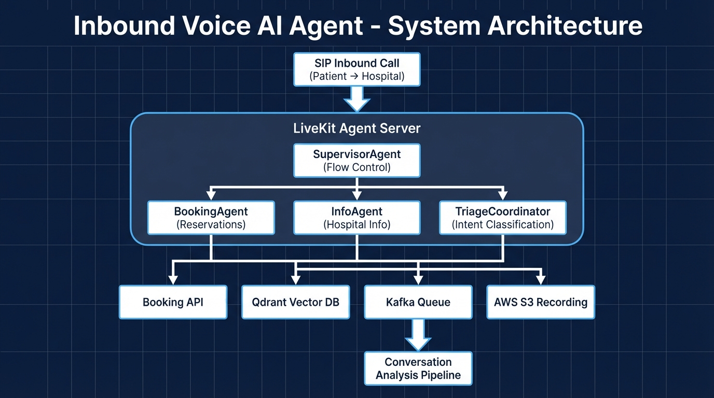
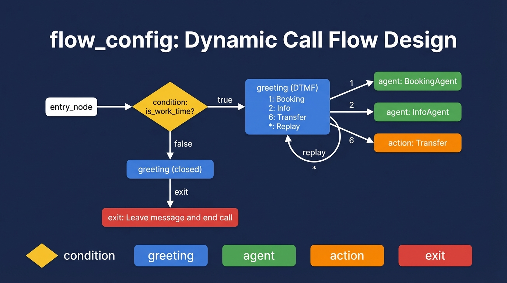
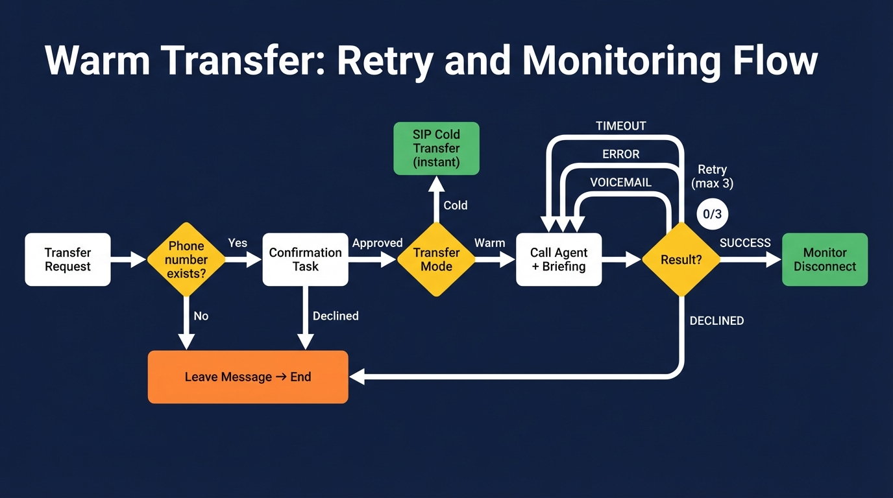

# 병원 인바운드 Voice AI Agent

> 병원으로 걸려오는 전화를 AI가 자동 응대하고, 설정 기반 콜 플로우로 예약·안내·상담원 연결을 동적으로 처리하는 실시간 음성 AI 시스템

---

## 프로젝트 개요

| 항목 | 내용 |
|------|------|
| **기간** | 2025 (1개월) |
| **소속** | 와이즈에이아이 |
| **선행 프로젝트** | 병원 아웃바운드 Voice AI Agent |
| **총 통화 성공** | 7만 건+ |
| **일 평균 통화** | 1,500건/일 |

아웃바운드 시스템은 병원이 환자에게 먼저 전화를 거는 발신 시스템이었습니다. 인바운드는 반대로 **환자가 병원에 전화를 걸면 AI가 응대하는 수신 시스템**입니다. 아웃바운드 운영 경험을 바탕으로, 병원마다 다른 전화 응대 시나리오를 코드 변경 없이 제어할 수 있는 설정 기반 아키텍처를 설계했습니다.

### 시스템 아키텍처



```
┌─────────────────────────────────────────────────────────────────────┐
│                       SIP 인바운드 연결                               │
│                      (환자 → 병원 전화)                               │
└─────────────────────────────┬───────────────────────────────────────┘
                              │
                              ▼
┌─────────────────────────────────────────────────────────────────────┐
│                     LiveKit Agent Server                             │
│                                                                      │
│   ┌─────────────────┐                                               │
│   │ SupervisorAgent  │ ◄─── flow_config 노드 그래프 순회             │
│   │ (플로우 제어)     │      조건 분기 / 인사말 / DTMF 처리            │
│   └────────┬────────┘                                               │
│            │                                                         │
│    ┌───────┼───────────┐                                            │
│    ▼       ▼           ▼                                            │
│ ┌──────────┐ ┌──────────┐ ┌────────────────┐                        │
│ │ Booking  │ │   Info   │ │    Triage      │                        │
│ │  Agent   │ │  Agent   │ │  Coordinator   │                        │
│ │ (예약)   │ │ (정보)   │ │ (의도 분류)     │                        │
│ └────┬─────┘ └────┬─────┘ └────────────────┘                        │
└──────┼─────────────┼────────────────────────────────────────────────┘
       │             │
       ▼             ▼
┌────────────┐  ┌────────────┐  ┌────────────┐  ┌────────────┐
│ Booking    │  │  Qdrant    │  │   Kafka    │  │  AWS S3    │
│   API      │  │ Vector DB  │  │ (분석 큐)  │  │ (녹음)     │
│ (예약CRUD) │  │ (병원정보) │  │            │  │            │
└────────────┘  └────────────┘  └────────────┘  └────────────┘
                                       │
                                       ▼
                          ┌────────────────────────┐
                          │  통화 분석 파이프라인     │
                          │  분류 → 전사 → 요약      │
                          └────────────────────────┘
```

### 기술 스택

| 분류 | 기술 |
|------|------|
| **Voice AI** | LiveKit Agents, OpenAI Realtime API, SIP Trunk |
| **AI / LLM** | Gemini 2.5 Pro, GPT-4.1, Pydantic |
| **Backend** | Python, Kafka |
| **Data** | Qdrant (Hybrid Search), MySQL |
| **Infra** | AWS ECS Fargate, S3, Docker |

---

## 1. 프로젝트 배경

### 아웃바운드에서 인바운드로

아웃바운드 시스템은 발신 전화의 시나리오가 비교적 단순합니다. 병원이 환자에게 먼저 전화를 걸기 때문에 "예약 확인 → 안내 → 종료"라는 흐름이 대부분입니다.

인바운드는 다릅니다. 환자가 전화를 걸어오기 때문에 **무엇을 원하는지 모르는 상태에서 시작**합니다.

| 차이점 | 아웃바운드 | 인바운드 |
|--------|----------|---------|
| 시작 주체 | 병원 (AI 발신) | 환자 (수신) |
| 시나리오 예측 | 높음 (예약 확인) | 낮음 (다양한 문의) |
| 콜 플로우 | 고정적 | 병원마다 다름 |
| 상담원 연결 | 간단한 Fallback | 핵심 기능 (Warm/Cold Transfer) |
| 입력 방식 | 음성만 | DTMF(키패드) + 음성 |

### 인바운드만의 도전 과제

1. **병원마다 다른 콜 플로우**: A 병원은 DTMF 메뉴로 시작하고, B 병원은 자유대화로 시작합니다. 병원별로 코드를 따로 만들 수 없습니다.
2. **상담원 연결의 복잡성**: "상담원 연결"이라는 단순해 보이는 기능이 실제로는 연결 방식(Warm/Cold), 재시도 로직, 실패 시 Fallback, 연결 후 모니터링까지 복잡한 상태 머신입니다.

---

## 2. flow_config: 동적 콜 플로우 설계

### 2.1 문제: 병원마다 다른 시나리오

병원마다 전화 응대 방식이 다릅니다.

| 병원 유형 | 원하는 시나리오 |
|----------|---------------|
| 대형 병원 | DTMF 메뉴 → 부서별 분기 → 예약/안내 |
| 소형 의원 | 자유대화 → AI가 의도 파악 → 즉시 처리 |
| 운영시간 외 | 인사말 → 메모 남기기 → 종료 |

이 모든 시나리오를 하드코딩하면 병원 수만큼 코드가 늘어납니다. 해결책은 **콜 플로우 자체를 데이터로 표현**하는 것이었습니다.

### 2.2 노드 그래프 아키텍처

`flow_config`는 콜 플로우를 **노드 그래프**로 정의합니다. SupervisorAgent가 진입 노드부터 순회하면서 각 노드 타입에 맞는 처리를 수행합니다.



```
flow_config (JSON)
    ↓
SupervisorAgent.on_enter()
    ↓
_process_node(entry_node_id)
    ↓
노드 타입별 처리 → 다음 노드 이동 → ... → 에이전트 전환 또는 통화 종료
```

**5가지 노드 타입:**

| 타입 | 역할 | 결과 |
|------|------|------|
| `condition` | 세션 값 기반 분기 | `branches`에서 다음 노드 결정 |
| `greeting` | 인사말 재생 / DTMF 수집 | 선택 키에 따른 다음 노드 |
| `agent` | 에이전트 전환 | Booking/Info/Triage 핸드오프 |
| `action` | 상담원 연결 / 로깅 | transfer 또는 다음 노드 이동 |
| `exit` | 통화 종료 | `session.shutdown()` |

### 2.3 두 가지 입력 방식

같은 시스템에서 DTMF(IVR)와 자유대화를 모두 지원합니다. `flow_config`의 노드 구성만 바꾸면 됩니다.

**DTMF 방식** — 대형 병원용:

```
greeting (DTMF)
  "1번: 예약 신청"  → booking_agent
  "2번: 예약 조회"  → booking_agent
  "5번: 병원정보"   → greeting2 (서브메뉴)
  "6번: 상담원"     → transfer_call (action)
  "*번: 다시듣기"   → greeting (자기 자신)
```

**자유대화 방식** — 소형 의원용:

```
greeting (voice)
  "안녕하세요, 궁금하신 점이 있다면 말씀해 주세요."
  → triage_coordinator (의도 분류 후 에이전트 전환)
```

### 2.4 조건 분기: 운영시간 판단

`condition` 노드는 세션 데이터를 평가해서 분기합니다. 대표적인 예가 운영시간 판단입니다.

```
condition (field: business_data.is_work_time)
  ├─ true  → greeting_operating  (운영시간 인사말)
  └─ false → greeting_closed     (운영시간 외 안내 → 메모 남기기)
```

코드를 변경하지 않고도 `business_data`, `recipient_data`, `call_config_data`의 어떤 필드든 분기 조건으로 사용할 수 있습니다.

### 2.5 DTMF 옵션의 컨텍스트 전달

DTMF 메뉴에서 선택한 번호만으로는 다음 에이전트가 사용자의 의도를 알 수 없습니다. 확장 형식을 통해 **선택과 함께 사용자 의도를 전달**합니다.

```json
{
  "1": {"next": "booking_agent", "user_request": "예약 신청"},
  "2": {"next": "booking_agent", "user_request": "예약 조회"},
  "3": {"next": "booking_agent", "user_request": "예약 취소"}
}
```

1번과 2번 모두 `booking_agent`로 전환되지만, `user_request`가 다르기 때문에 BookingAgent는 처음부터 적절한 도구를 호출할 수 있습니다. 에이전트가 "무엇을 도와드릴까요?"라고 다시 물을 필요가 없습니다.

---

## 3. 에이전트 계층과 행동 제어

### 3.1 아웃바운드 대비 구조 변화

아웃바운드의 Multi-Agent 구조(TriageCoordinator / BookingAgent / InfoAgent)를 그대로 유지하되, **SupervisorAgent를 최상위에 추가**했습니다.

```
아웃바운드:
  TriageCoordinator → BookingAgent / InfoAgent

인바운드:
  SupervisorAgent (flow_config 순회)
    → TriageCoordinator (자유대화 모드)
    → BookingAgent (DTMF 직접 전환)
    → InfoAgent (DTMF 직접 전환)
    → Action (상담원 연결)
    → Exit (통화 종료)
```

SupervisorAgent는 대화를 하지 않습니다. flow_config의 노드를 순회하면서 인사말 재생, DTMF 수집, 조건 평가를 수행하고, `agent` 노드에 도달하면 해당 에이전트로 전환합니다.

### 3.2 action_mode_handler: 도구별 동적 행동 제어

병원마다 같은 기능이라도 처리 방식이 다릅니다. A 병원은 예약 생성을 AI가 자동 처리하지만, B 병원은 예약 변경은 반드시 상담원이 처리해야 합니다.

이 문제를 `action_mode_handler` 데코레이터로 해결했습니다. 각 도구에 데코레이터를 적용하면, 실행 시점에 `agents_config` 설정을 확인해서 동작을 분기합니다.

```
도구 호출 → action_mode_handler 확인
  ├─ auto        → 원래 도구 로직 실행 (AI 자동 처리)
  ├─ transfer    → 상담원 연결 플로우로 전환
  └─ leave_memo  → 메모 남기기 후 종료
```

**설정 예시:**

```json
{
  "booking_agent": {
    "booking_create": "auto",
    "booking_modify": "leave_memo",
    "booking_cancel": "transfer"
  }
}
```

이 설정이면 예약 생성은 AI가 처리하고, 예약 변경은 메모를 남기고, 예약 취소는 상담원에게 연결합니다. 도구의 코드를 수정하지 않고 설정만으로 행동을 바꿀 수 있습니다.

---

## 4. 상담원 연결: Warm/Cold Transfer

### 4.1 단순해 보이지만 복잡한 기능

"상담원에게 연결해 주세요"는 사용자에게는 한 마디지만, 시스템에서는 여러 상태를 거치는 복잡한 흐름입니다.



```
상담원 연결 요청
  │
  ▼
상담원 번호 존재? ─── No ──→ 메모 남기기 → 종료
  │
  Yes
  │
  ▼
연결 확인 (AgentTransferConfirmationTask)
  │
  ├─ 거부 → 메모 남기기 → 종료
  │
  └─ 승인 → 연결 방식 판단
               │
               ├─ Cold Transfer → SIP 전환 (즉시 연결, AI 퇴장)
               │
               └─ Warm Transfer → 브리핑 후 연결 (아래 상세)
```

### 4.2 Cold Transfer vs Warm Transfer

| 방식 | 동작 | 장점 | 단점 |
|------|------|------|------|
| **Cold Transfer** | 환자를 상담원에게 즉시 연결, AI는 퇴장 | 빠름, 단순 | 상담원이 맥락 모름 |
| **Warm Transfer** | AI가 상담원에게 먼저 브리핑 후 환자 연결 | 상담원이 맥락 파악 | 복잡, 대기 시간 발생 |

### 4.3 Warm Transfer 상세 흐름

Warm Transfer는 3단계로 진행됩니다.

**1단계: 상담원 호출 + 브리핑**

AI가 상담원에게 전화를 걸고, 연결되면 지금까지의 대화 내용을 요약한 브리핑을 전달합니다.

```
브리핑 예시:
"안녕하세요, AI 상담 어시스턴트입니다.
 상담원 연결이 필요한 이유: 잇몸치료가 예약 가능 진료과 목록에 없음
 참고 사항: 희망 날짜 2월 10일 토요일, 오전 9시"
```

**2단계: 재시도 로직**

상담원이 응답하지 않을 수 있습니다. 상태별로 다르게 처리합니다.

| 상태 | 동작 |
|------|------|
| `TIMEOUT` | 재시도 (최대 3회) |
| `ERROR` | 재시도 (최대 3회) |
| `VOICEMAIL` | 재시도 (최대 3회) |
| `DECLINED` | 재시도 없이 즉시 중단 |
| `SUCCESS` | 모니터링 단계로 진행 |

3회 재시도 후에도 실패하면 환자에게 안내 후 **메모 남기기(leave_memo)** 로 전환합니다.

**3단계: 연결 후 모니터링**

상담원 연결이 성공하면 AI는 대화에서 빠지지만, **양측의 disconnect를 감시**합니다. 상담원이 먼저 끊거나 환자가 먼저 끊는 경우를 감지하여 세션을 정리합니다.

### 4.4 Transfer 결과 기록

모든 Warm Transfer 시도의 결과를 `WarmTransferRecord`로 기록합니다.

```python
@dataclass
class WarmTransferRecord:
    transfer_requested_at: Optional[str]    # 연결 요청 시각
    transfer_status: Optional[str]          # 결과 상태
    transfer_target_phone: Optional[str]    # 상담원 번호
    total_wait_seconds: Optional[float]     # 총 대기시간
    briefing_text: Optional[str]            # 상담원 브리핑 텍스트
```

이 기록은 통화 분석 파이프라인에서 활용되어, 상담원 연결 성공/실패 통계와 대기시간 분석에 사용됩니다.

---

## 5. 통화 분석 파이프라인

### 5.1 아웃바운드에서 배운 것

아웃바운드 시스템에서는 통화 분석에 **LLM + Hard Rules 하이브리드** 방식을 사용했습니다. LLM이 대화를 분석하고, 구조화된 로그(developer 메시지)로 판단을 보정하는 구조였습니다.

운영하면서 깨달은 것은, **로그 설계가 충분히 정교하면 분류 단계에서 LLM이 불필요하다**는 점이었습니다. 아웃바운드에서 LLM 보정이 필요했던 이유는 로그가 모든 케이스를 커버하지 못했기 때문이었습니다.

인바운드에서는 처음부터 **모든 도구 실행 결과와 상태 전환을 developer 메시지로 기록**하도록 설계했습니다. 그 결과, 분류 단계에서 LLM 호출 없이 태그 파싱만으로 정확한 분류가 가능해졌습니다.

### 5.2 파이프라인 흐름

```
┌─────────────┐     Kafka      ┌─────────────────────────────────────┐
│ Voice Agent │ ──── Queue ───► │      분석 파이프라인                  │
│  (통화 종료) │                 │                                     │
└─────────────┘                 │  Step 1: Normalize (대화 정규화)     │
                                │    ↓                                │
                                │  Step 2: Classify (태그 기반 분류)   │
                                │    ↓ developer 태그 파싱             │
                                │  Step 3: Transcribe (상담원 대화)    │
                                │    ↓ Warm Transfer 성공 시만 실행    │
                                │  Step 4: Playback (재생 구간 계산)   │
                                │    ↓                                │
                                │  Step 5: Summarize (LLM 요약)       │
                                │    ↓                                │
                                │  Step 6: Save (DB 저장)             │
                                └─────────────────────────────────────┘
```

### 5.3 100% 규칙 기반 분류

developer 태그를 파싱해서 24개 boolean 메타데이터를 추출합니다. LLM 호출이 없으므로 **100% 일관적이고 즉시 실행**됩니다.

**태그 예시와 분류 결과:**

| developer 태그 | 분류 결과 |
|---------------|----------|
| `[BOOKING_CREATE: STATUS=SUCCESS]` | `booking_create_completed = true` |
| `[BOOKING_MODIFY: MODE=TRANSFER]` + `[WARM_TRANSFER_CALL: STATUS=SUCCESS]` | `booking_modify_transferred = true` |
| `[WARM_TRANSFER_CALL: STATUS=FAILED, REASON=MAX_RETRIES_EXCEEDED]` | `transfer_timeout = true` |
| `[LEAVE_MESSAGE: STATUS=SUCCESS, BUSINESS_HOURS: FALSE]` | `leave_message_after_hours_success = true` |
| `[CALL_TERMINATION: ACTOR=SYSTEM, REASON=USER_RESPONSE_DELAY]` | `end_call_due_to_delay = true` |

**분류 카테고리:**

| 카테고리 | 필드 수 | 커버 범위 |
|---------|--------|----------|
| 예약 (Booking) | 12개 | 조회/생성/변경/취소 × 완료/미완료/상담원연결 |
| 정보문의 | 1개 | 조회 성공 여부 |
| 상담원 연결 | 4개 | 일반/직접 × 타임아웃/이탈 |
| 운영시간 기반 | 5개 | 운영시간 내외 × 연결성공/메모남김 |
| 기타 | 2개 | 지연종료/사용자요청종료 |

### 5.4 상담원 대화 전사

Warm Transfer가 성공하면, 상담원과 환자의 대화는 AI 세션 밖에서 진행됩니다. 이 구간의 오디오를 **사후에 전사**해서 대화 타임라인에 삽입합니다.

```
AI 대화                  상담원 대화 (전사로 복원)
─────────────────────── ───────────────────────────
assistant: "연결합니다"
developer: [TRANSFER SUCCESS]
                         user: "예약 변경하고 싶습니다"
                         consultant: "3월 20일로 변경해 드리겠습니다"
                         user: "오후 3시로 부탁드립니다"
                         consultant: "변경 완료했습니다"
developer: [CALL END]
```

`consultant` role을 도입하여 AI(assistant)와 인간 상담원(consultant)의 발화를 구분합니다. 이를 통해 **AI → 상담원 → 통화 종료까지 하나의 타임라인**으로 전체 통화를 추적할 수 있습니다.

### 5.5 Playback Segment

각 메시지에 오디오 재생 구간(`startRel`, `endRel`)을 서버에서 계산합니다. 대시보드에서 특정 발화를 클릭하면 해당 구간의 녹음을 바로 재생할 수 있습니다.

```json
{
  "role": "user",
  "content": "예약을 변경하고 싶습니다.",
  "playbackSegment": { "startRel": 3.0, "endRel": 5.0 }
}
```

클라이언트는 별도 계산 없이 `startRel` ~ `endRel` 구간만 재생하면 됩니다.

---

## 6. 기술적 의사결정 요약

| 의사결정 | 문제 | 선택 | 결과 |
|---------|------|------|------|
| flow_config 노드 그래프 | 병원마다 다른 콜 플로우 | JSON 기반 노드 그래프 + SupervisorAgent | 코드 변경 없이 병원별 시나리오 동적 제어 |
| DTMF + 자유대화 이중 지원 | 병원 규모별 다른 입력 선호 | greeting 노드의 input_method 분기 | 동일 시스템에서 IVR과 자연어 대화 모두 지원 |
| action_mode_handler | 같은 도구의 병원별 다른 처리 방식 | 데코레이터 패턴으로 설정 기반 분기 | 도구 코드 수정 없이 auto/transfer/leave_memo 전환 |
| Warm Transfer 재시도 | 상담원 미응답 시 통화 실패 | 3회 재시도 + 상태별 분기 + disconnect 모니터링 | 연결 성공률 향상, 실패 시 graceful fallback |
| 규칙 기반 분류 | 아웃바운드의 LLM 분류 일관성 부족 | developer 태그 설계 강화 → LLM 분류 제거 | 100% 일관적 분류, LLM 비용/지연 제거 |
| 상담원 대화 전사 | Transfer 후 대화 내용 추적 불가 | 성공 시 오디오 전사 + consultant role 삽입 | AI↔환자↔상담원 전체 타임라인 통합 |
| Kafka 비동기 분리 | 분석 실패 시 통화 서비스 영향 | Kafka 큐 기반 완전 분리 | 독립 스케일링, 장애 격리 |

---

## 7. 배운 점

**설정이 코드를 이긴다**: 병원마다 다른 시나리오를 코드로 분기하면 유지보수가 불가능해집니다. 콜 플로우를 데이터(JSON 노드 그래프)로 표현하고, SupervisorAgent가 그 데이터를 해석하도록 설계하면, 새 병원 추가가 설정 파일 하나로 끝납니다.

**로그 설계가 분석 품질을 결정한다**: 아웃바운드에서는 부족한 로그를 LLM으로 보완했습니다. 인바운드에서는 처음부터 모든 상태 전환을 developer 태그로 기록하도록 설계해서, 분류 단계에서 LLM 의존을 완전히 제거했습니다. 후처리의 품질은 후처리 단계가 아니라 데이터 생성 단계에서 결정됩니다.
