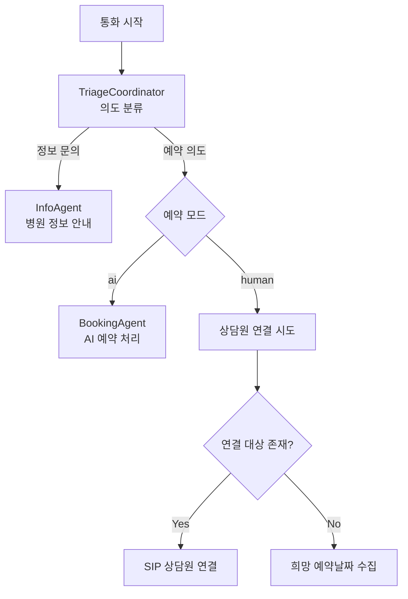

# 병원 아웃바운드 Voice AI Agent

> 병원 예약 확인·안내 전화를 AI가 자동으로 발신하고, 통화 내용을 자동 분석하는 실시간 음성 AI 시스템

---

## 프로젝트 개요

| 항목 | 내용 |
|------|------|
| **역할** | 1인 설계·개발·운영 (AI 엔지니어 / 팀장) |
| **기간** | 2025.03 - 현재 |
| **소속** | 와이즈에이아이 |

### 핵심 성과

| 지표 | 수치 |
|------|------|
| 총 통화 성공 | 55만 건+ |
| 일 평균 통화 | 2,500건/일 |
| 도입 병원 수 | 300개+ |
| 응답 레이턴시 | 약 900~1200ms |
| 지원 언어 | 6개 (한/영/중/일/스페인어/베트남어) |

### 시스템 아키텍처

```
┌─────────────────────────────────────────────────────────────────────┐
│                         발신 트리거                                   │
│                      (RabbitMQ Message)                             │
└─────────────────────────────┬───────────────────────────────────────┘
                              │
                              ▼
┌─────────────────────────────────────────────────────────────────────┐
│                     LiveKit Agent Server                             │
│                                                                      │
│   ┌─────────────────┐                                               │
│   │TriageCoordinator│ ◄─── 최초 진입점                              │
│   │   (의도 분류)    │      사용자 의도 파악 후 라우팅                │
│   └────────┬────────┘                                               │
│            │                                                         │
│    ┌───────┴───────┐                                                │
│    ▼               ▼                                                │
│ ┌──────────┐  ┌──────────┐                                          │
│ │ Booking  │  │   Info   │                                          │
│ │  Agent   │  │  Agent   │                                          │
│ │ (예약)   │  │ (정보)   │                                          │
│ └────┬─────┘  └────┬─────┘                                          │
└──────┼─────────────┼────────────────────────────────────────────────┘
       │             │
       ▼             ▼
┌────────────┐  ┌────────────┐  ┌────────────┐  ┌────────────┐
│ Booking    │  │  Qdrant    │  │  RabbitMQ  │  │  AWS S3    │
│   API      │  │ Vector DB  │  │ (분석 큐)  │  │ (녹음)     │
│ (예약CRUD) │  │ (병원정보) │  │            │  │            │
└────────────┘  └────────────┘  └────────────┘  └────────────┘
                                       │
                                       ▼
                          ┌────────────────────────┐
                          │  통화 분석 파이프라인     │
                          │  Gemini → Claude → GPT  │
                          └────────────────────────┘
```

### 기술 스택

| 분류 | 기술 |
|------|------|
| **Voice AI** | LiveKit Agents, OpenAI Realtime API, Google Gemini Live, SIP Trunk |
| **AI / LLM** | Gemini 2.5 Pro, Claude Sonnet, GPT-4.1, trustcall, LangChain |
| **Backend** | Python, FastAPI, RabbitMQ, Pydantic |
| **Data** | Qdrant (Hybrid Search: Dense + Sparse), PostgreSQL |
| **Infra** | AWS ECS Fargate, S3, Secrets Manager, CloudWatch, Docker, Auto Scaling |

---

## 1. 프로젝트 배경

### 병원 전화 업무의 현실

병원에는 하루 수백 통의 전화가 옵니다. 하지만 상당수는 비슷한 질문의 반복입니다.

| 문의 유형 | 비율 | 특징 |
|----------|------|------|
| 예약 조회/변경 | 40% | 단순 CRUD, 자동화 가능 |
| 진료시간/위치 안내 | 25% | 정형화된 정보 |
| 의료진/진료과 문의 | 20% | 검색 기반 응답 가능 |
| 복잡한 상담 | 15% | 상담원 필요 |

**85%의 전화가 AI로 처리 가능한 단순 업무**라는 점에 주목했습니다.

### 해결하려는 문제

- **환자**: 대기 시간 없이 즉시 응대
- **병원**: 상담 인력이 복잡한 업무에 집중
- **24시간**: 야간/주말에도 기본 문의 처리

이 시스템은 **아웃바운드(발신)** 에 집중합니다. 병원이 환자에게 먼저 전화를 걸어 예약을 확인하고 안내하는 업무를 AI가 대신합니다.

---

## 2. Multi-Agent Voice AI 설계

### 2.1 단일 Agent의 한계

처음에는 하나의 Agent로 모든 기능을 처리하려 했습니다.

**문제:**
- 프롬프트가 200줄을 넘어가면서 모델이 지시사항을 놓치는 경우 발생
- 도구가 14개가 되니 잘못된 도구를 호출하는 빈도 증가
- 예약 로직 수정 시 정보 안내에 영향을 줄까 걱정되어 유지보수 어려움

### 2.2 역할 기반 Agent 분리

해결책은 **역할별로 Agent를 분리**하는 것이었습니다.

```
Before (단일 Agent):
┌─────────────────────────────────┐
│         HospitalAgent           │
│  프롬프트: 200줄 | 도구: 14개    │
│  역할: 예약 + 정보 + 전환 + ...  │
└─────────────────────────────────┘

After (Multi-Agent):
┌─────────────────┐  ┌─────────────────┐  ┌─────────────────┐
│TriageCoordinator│  │  BookingAgent   │  │    InfoAgent    │
│ 프롬프트: 40줄   │  │ 프롬프트: 50줄  │  │ 프롬프트: 40줄   │
│ 도구: 3개       │  │ 도구: 5개       │  │ 도구: 6개        │
│ 역할: 의도 분류  │  │ 역할: 예약 처리  │  │ 역할: 정보 안내  │
└─────────────────┘  └─────────────────┘  └─────────────────┘
```

| 항목 | Before | After |
|------|--------|-------|
| 프롬프트 길이 | 200줄 | 각 40~50줄 |
| Agent당 도구 수 | 14개 | 3~6개 |
| 도구 오호출률 | 높음 | 현저히 감소 |
| 유지보수성 | 낮음 | 높음 (독립적 수정 가능) |

### 2.3 Agent 역할과 전환 플로우



**TriageCoordinator**는 교환원 역할입니다. 사용자의 발화를 듣고 의도를 분류하여 적절한 Agent로 라우팅합니다.

Agent 전환 시 **사용자의 원본 발화를 다음 Agent에 전달**합니다. 그렇지 않으면 다음 Agent가 처음부터 다시 질문해야 하기 때문입니다. 또한 전환 중에는 **오디오 입력을 일시 차단**(set_audio_enabled)하여 혼선을 방지합니다.

### 2.4 예약 플로우: 멀티턴 대화 처리

예약은 단순해 보이지만 여러 단계가 필요합니다. LiveKit의 `AgentTask`를 활용해 자체적인 대화 루프를 구현했습니다.

```
사용자: "예약하고 싶어요"
         │
         ▼
   ┌─────────────┐
   │ 진료과 선택  │ ← get_medical_departments()
   └──────┬──────┘
          │
          ▼
   ┌─────────────┐
   │ 날짜 확인   │ ← "다음주 화요일" → "2025-12-17" (LLM 변환)
   └──────┬──────┘
          │
          ▼
   ┌─────────────┐
   │ 시간 선택   │ ← select_available_schedules()
   └──────┬──────┘
          │
          ▼
   ┌─────────────┐
   │ 예약 생성   │ ← add_new_appointment()
   └──────┬──────┘
          │
          ▼
   "예약이 접수되었습니다"
```

**ScheduleSelectionTask 상태 흐름:**
```
collect_date → confirm_date → select_time → complete
```

사용자가 "다음주 화요일" 같은 자연어로 말하면 LLM이 ISO 날짜로 변환하고, 해석한 날짜를 사용자에게 확인받은 뒤 가능한 시간을 안내합니다.

### 2.5 Qdrant 벡터 DB 기반 정보 검색

InfoAgent는 Qdrant 벡터 DB에서 시맨틱 검색으로 병원 정보를 조회합니다.

**토픽별 데이터 구조:**

| 토픽 | 서브토픽 | 설명 |
|------|---------|------|
| `INTRODUCTION` | INFO, OPENING_HOURS, PROCEDURE, NOTICE | 병원 소개 |
| `VISIT_GUIDE` | PARKING, PUBLIC_TRANSPORT, FACILITY_LOCATIONS | 방문 안내 |
| `MEDICAL_STAFF` | - | 의료진 정보 |
| `MEDICAL_SERVICE` | - | 진료 서비스 |
| `EVENT` | - | 이벤트/프로모션 |

검색 시 `client.id`와 `topic`으로 필터링하여 **병원별, 카테고리별** 정확한 데이터만 반환합니다. Hybrid Search(Dense + Sparse)를 사용하여 "김 원장님" → "김철수 원장" 같은 시맨틱 매칭이 가능합니다.

### 2.6 OpenAI Realtime API

기존 파이프라인 방식과 Realtime API의 구조 차이입니다. 홉을 줄여 아키텍처는 단순해졌지만, 실제 응답 레이턴시는 900~1200ms 수준입니다.

```
기존: 음성 → [STT] → 텍스트 → [LLM] → 텍스트 → [TTS] → 음성
         (200ms)         (500ms)         (200ms)    = ~900ms

Realtime: 음성 → [OpenAI Realtime] → 음성
                 (~900-1200ms)
```

SIP 트렁크를 통해 실제 전화망과 연동하여 아웃바운드 콜 자동 발신을 구현했습니다.

### 2.7 실전 예외 처리

프로덕션에서 마주친 다양한 예외 상황과 해결 방법입니다.

#### 자동응답기(ARS) 감지

발신 전화가 자동응답기로 연결되는 경우, AI가 계속 대화를 시도하면 안 됩니다.

**3중 조건 검증** (모두 충족해야 감지):

| 조건 | 설명 | 예시 |
|------|------|------|
| 자동화된 인사말 | 녹음된 안내 메시지 | "소리샘 서비스입니다" |
| 버튼 입력 안내 | IVR 메뉴 프롬프트 | "1번을 눌러주세요" |
| 프롬프트 반복/루프 | 인간 개입 없이 반복 | 동일 메시지 2회 이상 |

조건 1개만 체크하면 오탐률이 높습니다. 예를 들어 "안녕하세요" 자동 인사만으로는 자동응답기라고 판단할 수 없습니다. 3가지 조건을 모두 체크해야 정확도가 보장됩니다.

#### 사용자 무응답 처리

전화를 받고 아무 말도 안 하는 케이스가 의외로 많습니다.

LiveKit의 `user_state_changed` 이벤트를 활용하여:
1. 사용자가 `away` 상태가 되면 확인 시작
2. 2번의 확인 시도 (각 5초 간격)
3. 인사말 미전송이면 인사말 전송, 전송 완료면 존재 확인
4. 2번 시도 후에도 응답 없으면 통화 종료

#### 상담원 연결 Fallback

모든 통화를 AI가 처리할 수 없습니다. 상담원 연결이 필요한 경우의 분기 처리:

| 상황 | 동작 |
|------|------|
| 명시적 상담원 요청 | 즉시 SIP 전환 (확인 불필요) |
| 예약 변경/취소 | 확인 후 SIP 전환 |
| human 예약 모드 + 연결 대상 있음 | SIP 상담원 연결 |
| human 예약 모드 + 연결 대상 없음 | 희망 예약날짜 수집 후 종료 |
| 불만/욕설 | 확인 후 전환 |

### 2.8 구조화된 로그 시스템

모든 도구 실행 결과를 세션 히스토리에 `developer` 메시지로 기록합니다. 이 로그는 통화 분석 파이프라인의 Hard Rules에서 직접 활용됩니다.

```
[RESERVATION_LOOKUP: STATUS=SUCCESS, COUNT=3]
[TRANSFER_CALL: STATUS=NO_TARGET]
[INFO_LOOKUP: STATUS=SUCCESS, TOPIC=MEDICAL_STAFF, QUERY="김철수", COUNT=1]
[CALL_TERMINATION: ACTOR=SYSTEM, REASON=USER_RESPONSE_DELAY]
```

이 구조화된 로그 설계는 Voice Agent와 분석 파이프라인을 연결하는 핵심 인터페이스입니다.

---

## 3. 통화 분석 파이프라인

### 3.1 왜 통화 분석이 필요한가

**문제 1: 실시간 STT 오류**

실시간 처리의 속도를 위해 음성 인식 품질이 완벽하지 않습니다.

| 문제 유형 | 예시 | 빈도 |
|----------|------|------|
| Ghost Message | 침묵이 "네네네"로 인식 | 높음 |
| 혼합 언어 오류 | "10시" → "ten시" | 중간 |
| 순서 뒤바뀜 | 사용자 응답 순서 오류 | 낮음 |
| 누락 | 짧은 응답 미인식 | 중간 |

**문제 2: 통화 결과 파악**

일 2,500건의 통화에서 각각 무슨 일이 있었는지 파악해야 합니다. 예약이 완료되었는지, 상담원 연결이 필요한지, 환자가 긍정적으로 반응했는지 등을 자동으로 분류해야 합니다.

### 3.2 3단계 비동기 파이프라인

통화 종료 후 RabbitMQ를 통해 분석 서비스로 비동기 전달됩니다. Voice Agent는 통화 처리에만 집중하고, 분석은 독립적으로 스케일링됩니다.

```
┌─────────────┐     RabbitMQ     ┌─────────────────────────────────────┐
│ Voice Agent │ ──── Queue ────► │      분석 파이프라인                  │
│  (통화 종료) │                  │                                     │
└─────────────┘                  │  Step 0: Transcriber (Gemini 2.5)   │
                                 │    ↓ 오디오+텍스트 비교, STT 교정     │
                                 │  Step 1: Analyzer (Claude/GPT-4.1)  │
                                 │    ↓ 15개 메타데이터 자동 추출        │
                                 │  Step 2: Summarizer (GPT-4.1)       │
                                 │    ↓ 환자 관점 요약 생성             │
                                 └──────────────┬──────────────────────┘
                                                │
                                    ┌───────────┴───────────┐
                                    ▼                       ▼
                              ┌──────────┐          ┌──────────────┐
                              │ DB 저장   │          │ 실시간 이벤트 │
                              └──────────┘          └──────────────┘
```

#### Step 0: 음성 전사 교정 (Gemini 2.5 Pro)

해결책은 **원본 오디오를 다시 듣는 것**입니다. Gemini 2.5 Pro는 오디오 파일을 직접 이해할 수 있는 멀티모달 모델이므로, 원본 오디오와 STT 텍스트를 함께 비교하여 교정합니다.

**핵심 처리:**
- Ghost Message 감지 및 삭제 (오디오에 없는 가짜 발화)
- 혼합 언어 오류 교정
- 메시지 순서 재정렬
- 각 발화의 start_time 측정

**DTMF 예외 처리:**

DTMF(키패드 입력)는 음성이 아니므로 오디오에 없는 게 정상입니다. Ghost Message로 오인하면 주민번호 입력 같은 중요 정보가 손실됩니다. 프롬프트에 "DTMF 메시지는 절대 삭제 금지"를 명시하여 해결했습니다.

#### Step 1: 대화 분석 (trustcall + Claude Sonnet / GPT-4.1)

[trustcall](https://github.com/hinthornw/trustcall) 라이브러리를 사용하여 15개 메타데이터를 구조화된 형태로 추출합니다.

trustcall은 전체 JSON을 재생성하는 대신 **JSON Patch 연산**으로 수정이 필요한 부분만 패치하여, 복잡한 스키마에서도 안정적인 출력을 보장합니다.

**추출하는 메타데이터 (일부):**

| 카테고리 | 필드 | 설명 |
|---------|------|------|
| 상담원 연결 | `transfer_call_request` | 상담원 연결 성공 여부 |
| | `agent_consultation_request` | 상담원 연결 필요 (미완료) |
| 통화 종료 | `end_call_due_to_delay` | 응답 지연으로 종료 |
| | `end_call_by_user_rejection` | 거절 후 종료 |
| 예약 | `reservation_creation_complete` | 예약 생성 완료 |
| | `reservation_change_request` | 예약 변경 요청 |
| 응답 | `positive_response` | 긍정 응답 |
| | `unclear_response` | 불분명한 응답 |

#### LLM + Hard Rules 하이브리드 판단

LLM 판단만으로는 일관성이 부족한 경우, **구조화된 로그 기반 규칙**으로 보정합니다.

**예시: 상담원 연결 판단**

대화에서 "상담원 연결해주세요" → AI: "연결해드리겠습니다"라고 했더라도, LLM은 `transfer_call_request = True`로 판단할 수 있습니다. 하지만 실제 연결 성공 여부는 로그를 봐야 합니다.

```
로그: [TRANSFER_CALL: STATUS=REQUESTED]  (시도만 함, 성공 아님)
→ Hard Rule 보정: transfer_call_request = False
                  agent_consultation_request = True  (후속 조치 필요)
```

| LLM의 장점 | Hard Rules의 장점 |
|-----------|-----------------|
| 맥락 이해, 유연한 판단 | 100% 일관성, 예측 가능 |
| 새로운 패턴 대응 | 명확한 기준의 정확한 판단 |

**둘의 조합이 최선입니다.**

#### Step 2: 대화 요약 (GPT-4.1)

환자의 액션/반응 관점에서 요약합니다.

```
좋은 요약 (결과 중심):
  제목: "예약 리마인드 - 참석 확인 완료"
  내용: "12월 17일 10시 정형외과 예약 확인 / 환자 참석 의사 확인 / 추가 문의 없이 정상 종료"

나쁜 요약 (과정 나열):
  "AI가 인사를 하고 예약을 안내했습니다. 환자가 응답했습니다. 통화가 종료되었습니다."
```

### 3.3 비즈니스 로직 연동

분석 결과는 대시보드 통계, 상담원 업무 큐 자동 생성, 품질 개선 피드백에 활용됩니다.

병원마다 예약 처리 방식(`ai` / `human`)이 다르므로, human 모드에서 상담원 연결 실패 시 "상담원 콜백 필요" 리스트에 자동 추가하는 등의 분기 처리를 구현했습니다.

---

## 4. 프로덕션 인프라

### 4.1 AWS ECS Fargate 아키텍처

| 환경 | CPU | Memory | 용도 |
|-----|-----|--------|------|
| DEV | 2 vCPU | 4 GB | 개발/테스트 |
| QA | 2 vCPU | 4 GB | 품질 검증 |
| PROD | 4 vCPU | 8 GB | 프로덕션 서비스 |

- **Multi-AZ 구성**: 2개 가용 영역(ap-northeast-1a, 1c)에 분산 배치하여 고가용성 확보
- **프라이빗 서브넷**: 모든 ECS 서비스가 프라이빗 서브넷에서 실행, 외부 직접 접근 불가

### 4.2 비용 최적화 스케일링

한국 병원 운영시간에 맞춘 시간 기반 스케일링과 메트릭 기반 동적 스케일링을 조합했습니다.

**시간 기반 스케줄 (KST):**

| 시간 | 동작 | Task 수 |
|------|------|--------|
| 07:50 | 서비스 시작 | Min: 3 |
| 09:30 | 용량 증가 (오전 피크) | Min: 10 |
| 17:00 | 오후 용량 | Min: 2 |
| 21:30 | 서비스 중지 | Min: 0, Max: 0 |

**메트릭 기반 스케일링:**

| 메트릭 | 임계값 | Scale-out | Scale-in |
|--------|--------|-----------|----------|
| CPU | 50% | 20초 | 300초 |
| Memory | 50% | 20초 | 300초 |

최대 20 태스크까지 동적으로 확장됩니다. 야간에는 완전 중지하여 비용을 최적화합니다.

### 4.3 운영 체계

- **AWS Secrets Manager**: API 키 9개 (LiveKit, OpenAI, Google, Anthropic, RabbitMQ, AWS 등) 중앙 관리
- **CloudWatch**: JSON 구조화 로그 모니터링, 환경별 로그 그룹 분리
- **Docker (ARM64)**: uv + Python 3.13 기반 경량 컨테이너

---

## 5. 기술적 의사결정 요약

| 의사결정 | 문제 | 선택 | 결과 |
|---------|------|------|------|
| Multi-Agent 분리 | 단일 Agent의 도구 오호출 | 3개 역할별 Agent | 오호출률 현저히 감소 |
| OpenAI Realtime API | STT→LLM→TTS 개별 호출의 순차 레이턴시 | 단일 Realtime 호출로 통합 | 약 900~1200ms로 안정화, 아키텍처 단순화 |
| Gemini 멀티모달 교정 | 실시간 STT Ghost Message | 원본 오디오 재청취 | STT 품질 대폭 개선 |
| trustcall | 복잡한 스키마 구조화 출력 불안정 | JSON Patch 기반 추출 | 15개 메타데이터 안정 추출 |
| LLM + Hard Rules | LLM 판단 일관성 부족 | 로그 기반 규칙 보정 | 분석 정확도 향상 |
| RabbitMQ 서비스 분리 | 분석 실패 시 통화 영향 | 비동기 큐 기반 | 독립 스케일링, 장애 격리 |
| 시간 기반 스케일링 | 야간 리소스 낭비 | 병원 운영시간 맞춤 | 비용 최적화 |

---

## 6. 배운 점

**Multi-Agent의 힘**: 단일 Agent로 모든 걸 처리하려다 프롬프트 200줄, 도구 14개가 되었을 때의 혼란을 겪고 나서, 역할 분리의 중요성을 체감했습니다. 각 Agent가 자신의 역할에만 집중하면 프롬프트가 단순해지고, 도구 오호출이 줄고, 독립적으로 수정할 수 있습니다.

**실제 사용자는 예상과 다르게 행동합니다**: "다음주 화요일" 같은 자연어 날짜 표현, 전화 받고 아무 말 안 하는 케이스, 중간에 갑자기 다른 질문으로 전환. 규칙 기반으로는 한계가 있어서 LLM 활용이 필수였습니다.

**STT 품질은 후처리로 개선 가능합니다**: 실시간 처리의 한계를 받아들이고, 사후에 오디오를 다시 들어서 교정하는 접근이 효과적이었습니다. 실시간으로 통화하고, 사후에 교정하는 이중 전략이 최선입니다.
