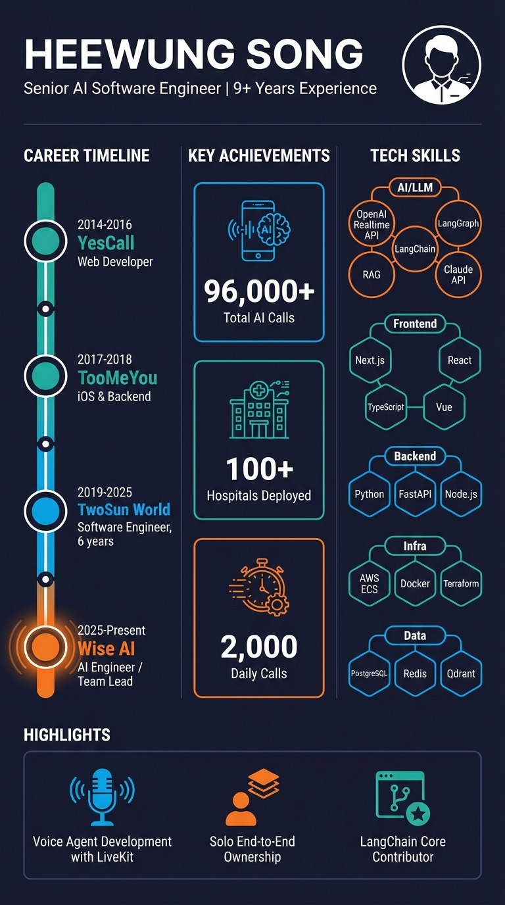

# 송희웅

- 연락처: +82-10-3098-2011
- 이메일: [kofsitho@naver.com](mailto:kofsitho@naver.com)
- GitHub: [https://github.com/kofsitho87](https://github.com/kofsitho87)
- LinkedIn: [https://www.linkedin.com/in/kofsitho](https://www.linkedin.com/in/kofsitho)
- Tech Blog: [https://medium.com/@kofsitho](https://medium.com/@kofsitho)

## Professional Summary

9년 이상의 경력을 가진 시니어 소프트웨어 엔지니어입니다. 프론트엔드, 백엔드, 인프라를 아우르며 제품을 설계하고 출시해 왔고, 최근에는 병원 아웃바운드 Voice AI 시스템을 단독으로 설계·개발·운영하며 100개 병원에 도입, 일 2,000건의 실시간 AI 통화를 처리하는 프로덕션 서비스를 구축했습니다.

Multi-Agent 아키텍처 설계, OpenAI Realtime API 기반 실시간 음성 처리, LLM 기반 통화 분석 파이프라인 등 AI 애플리케이션의 설계부터 프로덕션 운영까지 엔드투엔드 오너십에 강점이 있습니다. LangChain 오픈소스 Core Contributor로도 활동했습니다.

## Core Competencies

- Frontend: Next.js, React, TypeScript, Tailwind CSS, shadcn/ui, TanStack Query, Vue, Vuetify
- Backend: Python, FastAPI, Node.js
- AI / LLM: OpenAI Realtime API, Claude API, LangGraph, LangChain, RAG, trustcall, LangSmith
- Voice AI & Telephony: LiveKit Agents, SIP Trunk, WebRTC, STT/TTS
- Data / Search: PostgreSQL, MySQL, Redis, MongoDB, Qdrant, hybrid search (Dense + Sparse), OpenAI Embeddings, BM25, cross-encoder reranking
- Infra / DevOps: AWS ECS Fargate, ECR, ALB, VPC, S3, Secrets Manager, CloudWatch, Docker, Auto Scaling, Multi-AZ, GitHub Actions, Terraform

## Experience

### 와이즈에이아이

**AI 엔지니어 / AI 프로덕트 팀장**  
2025.03 - 현재

병원 Voice AI 제품을 1인 설계·개발·운영하거나 핵심 아키텍트로 리드하며, 실시간 통화 시스템부터 상담 구조, 분석 파이프라인, 운영 인프라까지 엔드투엔드로 구축했습니다.

| 지표 | 수치 |
|------|------|
| 총 통화 성공 | 96,000건+ |
| 일 평균 통화 | 2,000건/일 |
| 도입 병원 수 | 100개+ |
| 지원 언어 | 6개 (한/영/중/일/스페인어/베트남어) |

#### 병원 아웃바운드 Voice AI Agent 설계 및 운영

병원의 예약 확인·안내 전화를 AI가 자동 발신하고, 통화 종료 후 전사 교정·구조화 분석·요약까지 비동기로 처리하는 실시간 Voice AI 시스템을 설계·개발·운영했습니다.

- 단일 Agent의 프롬프트 과대화와 도구 오호출 문제를 분석해 `TriageCoordinator` / `BookingAgent` / `InfoAgent`로 분리된 Multi-Agent 아키텍처를 설계했습니다.
- OpenAI Realtime API와 SIP 트렁크를 결합해 실제 전화망 기반 아웃바운드 콜 시스템을 구현했습니다. 기존 STT→LLM→TTS 파이프라인 약 900ms를 약 300ms 수준으로 줄여 자연스러운 실시간 대화 경험을 만들었습니다.
- 예약 CRUD를 멀티턴 대화 플로우로 설계하고, Qdrant 기반 병원 정보 검색 도구를 붙여 예약 처리와 병원 안내를 한 통화 안에서 이어지도록 만들었습니다.
- 자동응답기 3중 조건 감지, 사용자 무응답 종료, 상담원 연결 및 메시지 수집 fallback 등 프로덕션 예외 처리 로직을 구축해 실제 운영 환경에서의 실패 케이스를 흡수했습니다.
- Gemini 2.5 Pro 멀티모달 기반 STT 교정, Ghost Message 제거, DTMF 보존 예외 처리, trustcall 기반 메타데이터 추출을 포함한 통화 분석 파이프라인을 구현했습니다.
- RabbitMQ로 통화 처리와 분석 처리를 분리하고, AWS ECS Fargate DEV/QA/PROD 3환경, Multi-AZ, 시간 기반 + 메트릭 기반 오토스케일링(최대 20 태스크), Secrets Manager, CloudWatch 구조화 로그 체계를 설계해 운영 안정성과 비용 효율을 함께 확보했습니다.

기술: Python, LiveKit Agents, OpenAI Realtime API, SIP, RabbitMQ, Qdrant, Gemini 2.5 Pro, Claude Sonnet, GPT-4.1, trustcall, Pydantic, AWS ECS Fargate, S3, Secrets Manager, CloudWatch, Docker, VPC, Auto Scaling

#### 병원 인바운드 Voice AI Agent 설계

2025

아웃바운드 운영 경험을 바탕으로, 환자가 병원에 전화를 걸었을 때 병원별 시나리오를 코드 변경 없이 제어할 수 있는 인바운드 Voice AI 시스템을 설계했습니다.

- 병원마다 다른 전화 응대 방식을 하드코딩하지 않기 위해 `flow_config` 기반 노드 그래프 아키텍처를 설계했습니다. `condition` / `greeting` / `agent` / `action` / `exit` 노드를 조합해 DTMF IVR과 자유대화 플로우를 동일 엔진에서 처리할 수 있게 만들었습니다.
- 기존 Multi-Agent 구조 위에 `SupervisorAgent`를 추가해 콜 플로우 제어와 실제 응답 에이전트의 책임을 분리했습니다. 설정만으로 운영시간 분기, 메뉴 라우팅, 상담원 연결, 종료 시나리오를 바꿀 수 있도록 했습니다.
- 도구 실행 시점에 `auto` / `transfer` / `leave_memo`를 동적으로 분기하는 `action_mode_handler` 패턴을 설계해, 병원별 운영 정책 차이를 코드 수정 없이 반영할 수 있게 했습니다.
- Warm/Cold Transfer 상태 흐름, 재시도 로직, 연결 실패 fallback, 연결 후 모니터링까지 포함한 상담원 연결 구조를 설계해 AI 응대와 사람 상담 사이의 운영 경계를 제품 수준으로 정리했습니다.
- Kafka 기반 비동기 분석 파이프라인으로 정규화, 규칙 기반 메타데이터 추출, 상담원 대화 전사, 요약 저장 흐름을 분리해 인바운드 운영 데이터의 후처리 구조를 구축했습니다.

기술: Python, LiveKit Agents, OpenAI Realtime API, SIP, Kafka, Qdrant, Gemini 2.5 Pro, GPT-4.1, Pydantic, AWS ECS Fargate, S3, Docker

#### 병원 고객상담 AI Agent 시스템 아키텍처 설계 및 배포

2025.03 - 2025.05

의료기관 고객 상담 자동화를 위해, 단순 FAQ 응답기가 아니라 병원별 지식 조회와 개인정보 수집, 상담원 연결 준비를 하나의 흐름으로 다루는 상담 시스템 아키텍처를 주도했습니다.

- LangGraph 기반으로 `primary_assistant`, `customer_interaction`, `extract_personal_info`, `tools` 흐름을 분리하고, `pending_question`, `collected_info` 같은 상태를 명시적으로 관리해 절차가 섞인 상담을 안정적으로 처리할 수 있게 설계했습니다.
- 병원 웹사이트 데이터를 수집·구조화해 검색 가능한 지식 레이어를 만들고, Qdrant 기반 조회 구조를 통해 병원별 운영시간, 방문 안내, 의료진, 진료·시술 정보를 상담 응답에 연결했습니다.
- FastAPI + LangGraph SDK 기반 비동기 API 서버, 검색 시스템, Next.js 운영 대시보드, AWS ECS Fargate 배포 구조를 하나의 서비스 경계로 설계해 상담 로직이 프로토타입이 아니라 운영 가능한 제품으로 이어지도록 만들었습니다.
- 상담원 연결 시 필요한 개인정보 수집과 원래 질문 복귀 흐름을 분리해, 사용자가 같은 맥락을 반복 설명하지 않아도 되도록 상담 UX와 운영 절차를 함께 정리했습니다.

기술: Python, FastAPI, LangGraph, LangChain, trustcall, Crawl4ai, Qdrant, PostgreSQL, Redis, Next.js 15, LangSmith, AWS ECS Fargate, ALB, VPC, ECR, GitHub Actions, Docker, Terraform

---

### 투썬월드

**소프트웨어 엔지니어**
2019.03 - 2025.02 (6년)

교육 및 AI 기반 서비스에서 웹 제품 개발과 신규 기능 구현을 담당했습니다. 서비스 기획 의도를 제품 기능으로 구체화하고, 프론트엔드 구현부터 데이터 처리, AI 기능 실험까지 폭넓게 수행했습니다.

#### RAG 비자 챗봇 시스템 설계 및 개발

2024.02 - 2024.04

- 비자 관련 문서를 마크다운으로 전처리하고, 벡터 데이터베이스 기반의 검색 가능한 지식베이스로 재구성했습니다.
- BM25 키워드 검색과 임베딩 기반 시맨틱 검색을 결합한 하이브리드 검색 아키텍처를 설계했습니다. 키워드 검색(Recall) → 시맨틱 검색(Precision) → cross-encoder reranker(최종 순위)로 이어지는 3단계 파이프라인을 구현했습니다.
- 청킹 전략(512 tokens, overlap 50), 인덱싱 방식, 메타데이터 구조를 최적화하고 캐싱 레이어를 도입해 빈번한 질의의 응답 시간을 80% 단축했습니다.
- LangSmith 트레이싱과 사용자 피드백 수집을 적용해 검색 품질을 지속적으로 모니터링하고 A/B 테스트를 통해 검색 파라미터를 최적화했습니다.

#### 크롤링 및 데이터 수집·처리 파이프라인 설계

2024.06 - 2024.07

- 대규모 데이터 수집을 위한 크롤링, 전처리, 분류, 검증, 번역 파이프라인을 설계하고 구현했습니다.
- 비동기 처리와 멀티스레딩 병렬화를 적용해 크롤링 처리 속도를 300% 개선했습니다.
- 데이터 검증 및 정합성 확인을 자동화해 데이터 정확도 95% 이상을 유지하는 파이프라인을 구축했습니다.
- JSONL 기반 구조화 로그, Slack/Email 실시간 알림, 성능 메트릭 대시보드를 구성해 운영 모니터링 체계를 만들었습니다.

#### AI 면접 데모 및 AI 자기소개서 첨삭 기능 개발

2024.11

- OpenAI Realtime API와 LiveKit Agent를 활용해 음성 기반 AI 면접 PoC를 개발했습니다.
- 이력서 업로드 기반 자기소개서 AI 첨삭 기능을 구현했습니다.
- CrewAI를 활용해 면접 대화 내용 기반 평가 및 점수화 기능을 구현했습니다.

#### 백오피스 애플리케이션 개발

2024.09 - 2024.11

- Next.js 15 기반 백오피스 애플리케이션을 구축하고, 다국어 채용 공고 관리 기능을 개발했습니다.
- Claude 기반 자동 번역 기능을 서비스 운영 흐름에 통합했습니다.

#### 한국어 교육 플랫폼 개발

2023.09 - 2024.01 | 15명 규모 프로젝트

- Next.js 14, TypeScript, Tailwind CSS, shadcn/ui 기반 반응형 웹 UI를 구현했습니다.
- REST API 연동을 통해 강의 콘텐츠 제공과 학습 진행 상태 추적 기능을 개발했습니다.
- OpenAI, Gemini 기반 프롬프트 실험을 통해 한국어 학습용 콘텐츠 생성 기능을 개발했습니다.
- 프론트엔드 성능을 최적화해 Lighthouse 점수를 65점에서 91점으로 개선했습니다 (페이지 로딩 속도 40% 향상).

#### 공맵 멘토링 플랫폼

2023.04 - 2023.08

- 해외 교육 과정(SAT, IB, AP, A-Level) 준비생을 위한 온라인 멘토링 플랫폼을 설계하고 개발했습니다.
- 학습 요구사항과 멘토 전문성을 반영한 매칭 알고리즘을 구현했습니다.
- 입시 정보, 대학 리소스, 에세이 가이드를 통합 제공하는 제품 흐름을 설계했습니다.

기술: TypeScript, Next.js, React, Vue, Vuetify, Pinia, TanStack Query, MongoDB, AWS, OpenAI, Gemini, LiveKit, CrewAI, LangSmith

---

### 투미유

**소프트웨어 엔지니어**
2017.10 - 2018.12 (1년 3개월)

- 영어회화 학습 서비스 "투덥"의 iOS 앱과 백엔드를 개발했습니다.
- Swift 기반 iOS 앱 개발, Laravel 기반 서버 개발, AWS 인프라 운영을 담당했습니다.

기술: Swift, PHP, Laravel, Redis, Docker, AWS (EC2, ELB, S3, RDS), FFmpeg

---

### 예스콜닷컴

**웹 개발자**
2014.12 - 2016.02 (1년 3개월)

- 반응형 웹 빌더 "DUBUPLUS"와 쇼핑몰 제작 플랫폼의 프론트엔드·백엔드를 개발했습니다.
- 결제 시스템, 관리자 모듈, SEO 최적화, 소셜 연동 기능을 구현했습니다.

기술: JavaScript, jQuery, AngularJS, PHP, MySQL

## Education

### 대진대학교

- 철학과 졸업
- 2006.03 - 2013.08

## Open Source & Community

### LangChain-OpenTutorial Core Contributor

2025.02

- LangChain 공식 튜토리얼 오픈소스 프로젝트에 참여해 Core Contributor로 등록되었습니다.
- [https://github.com/LangChain-OpenTutorial/LangChain-OpenTutorial](https://github.com/LangChain-OpenTutorial/LangChain-OpenTutorial)

### 지피터스 AI 프로덕트 사례 발표

2024.10

- LiveKit Agent 기반 AI 영어 선생님 프로젝트를 제작하고 커뮤니티에서 사례를 발표했습니다.
- [사례발표 1](https://www.gpters.org/chatbot/post/ai-roleplaying-conversation-application-qnoe9TQDzZv9lQM) | [사례발표 2](https://www.gpters.org/chatbot/post/ai-roleplaying-conversation-application-iF1DFPjzxXdvSlm)

## Language

- 영어: 일상 회화
